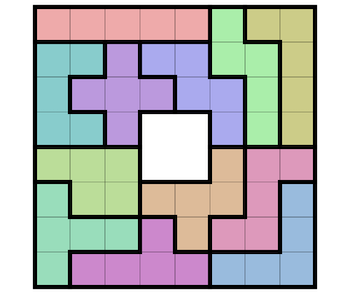

---
jupytext:
  text_representation:
    extension: .md
    format_name: myst
kernelspec:
  display_name: Python 3 (ipykernel)
  language: python
  name: python3
language_info:
  name: python
  nbconvert_exporter: python
  pygments_lexer: ipython3
---

# images

```{code-cell} ipython3
# but first one code cell and its rendering

10 * 30
```

several variations on inserting an image

+++

## regular markdown


+++

## MyST Syntax

we can set more layout parameters here

```{image} media/board-8x8.png
:width: 100px
:align: center
```

+++

## inside admonitions (no dropdown)

testing within plainly visible admonitions - not messing with the size this time

```{admonition} no dropdown and regular markdown

```

````{admonition} no dropdown and with MyST syntax
```{image} media/board-8x8-small.png
```
````

+++

## inside dropdown admonitions

same within dropdown admonitions

```{admonition} with dropdown and regular markdown
:class: dropdown

```

````{admonition} with dropdown and with MyST syntax
:class: dropdown
```{image} media/board-8x8-small.png
```
````

+++

## former bugs

this now works smoothly, no longer need an extra &lt;div&gt; wrapping the image

### with a width

````{admonition} with dropdown, MyST syntax and width
:class: dropdown seealso

```{image} media/board-8x8-small.png
:width: 500px
```
````

+++

### more than an image: here some text

````{admonition} same, but adding text around the image
:class: dropdown seealso
some text before

```{image} media/board-8x8-small.png
:width: 500px
```

some text after
````

+++

### several images

`````{admonition} same, with multiple images
:class: dropdown seealso
some text before

```{image} media/board-8x8-small.png
:width: 500px
```

some text in the middle, another image (even if it looks the same)

```{image} media/board-8x8.png
:width: 200px
```

some text after
`````

+++

## inline images ?

wondering if one can use an image like it was a font character
 and **insert it inline**

as of 2025 april:
- this works with jlab
- but with mystmd/jb2:
  - it causes line breaks in the devel version (`mystmd start --execute`)
  - while the published version (`myst build --execute`) renders this on a single line allright

in any case remember the markdown syntax does not let us set a size, so for this example to work we have produced a resized image...

+++

## inlined image with a html tag ?

same but this time we use  html fragment with an explicit size:  to insert the image and **insert it inline**

not only it does cause a line break, but it also does not resize the image !
